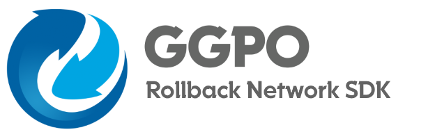

## What's GGPO?
Traditional techniques account for network transmission time by adding delay to a players input, resulting in a sluggish, laggy game-feel.  Rollback networking uses input prediction and speculative execution to send player inputs to the game immediately, providing the illusion of a zero-latency network.  Using rollback, the same timings, reactions visual and audio queues, and muscle memory your players build up playing offline translate directly online.  The GGPO networking SDK is designed to make incorporating rollback networking into new and existing games as easy as possible.  

For more information about the history of GGPO, check out http://ggpo.net/

This repository contains the code, documentation, and sample applications for the SDK.

## Building
Building GGPO is currently only available on Windows, however efforts are being made to port it to other platforms.

### Windows 
Windows builds requires both [Visual Studio 2019](https://visualstudio.microsoft.com/downloads/) and [CMake](https://cmake.org/download/).  Make sure you've installed both before starting.  Make sure to add CMake to your path when installing.

- Run the `build_windows.cmd` in the root directory of the SDK to generate the Visual Studio 2019 solution files.   
- Open `build/GGPO.sln` solution for Visual Studio 2019 to compile.

You can also run the `cmake-gui` tool if you prefer. 

## Licensing
GGPO is available under The MIT License. This means GGPO is free for commercial and non-commercial use. Attribution is not required, but appreciated. 

