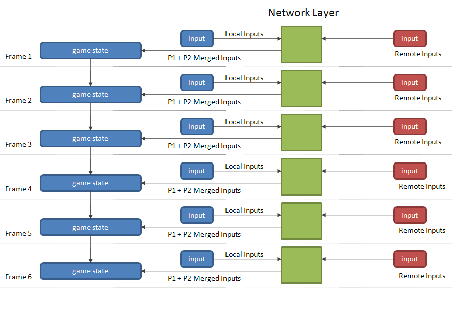
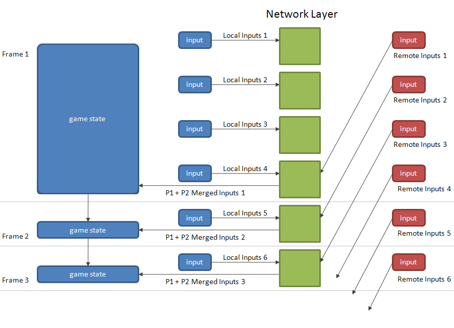
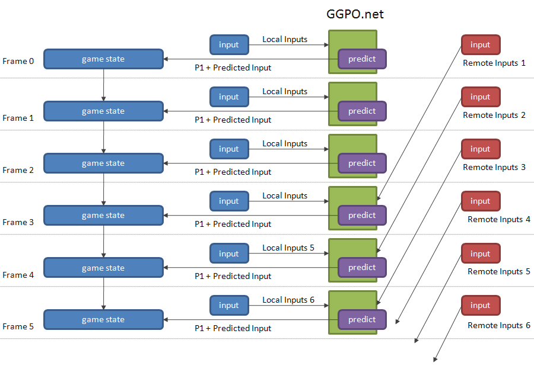
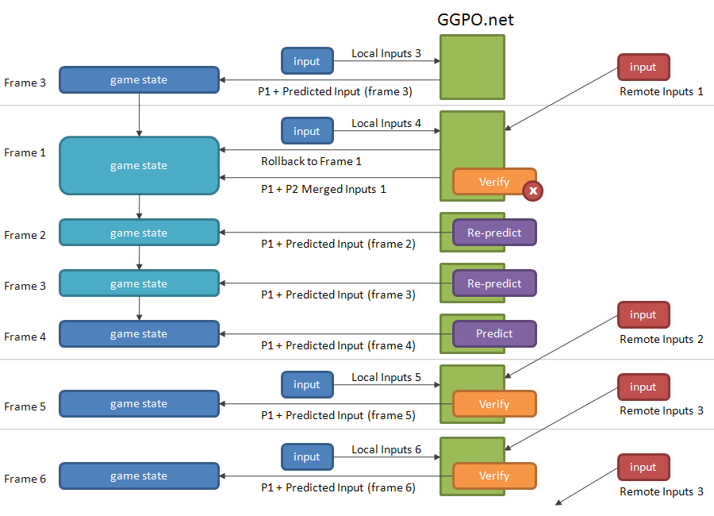
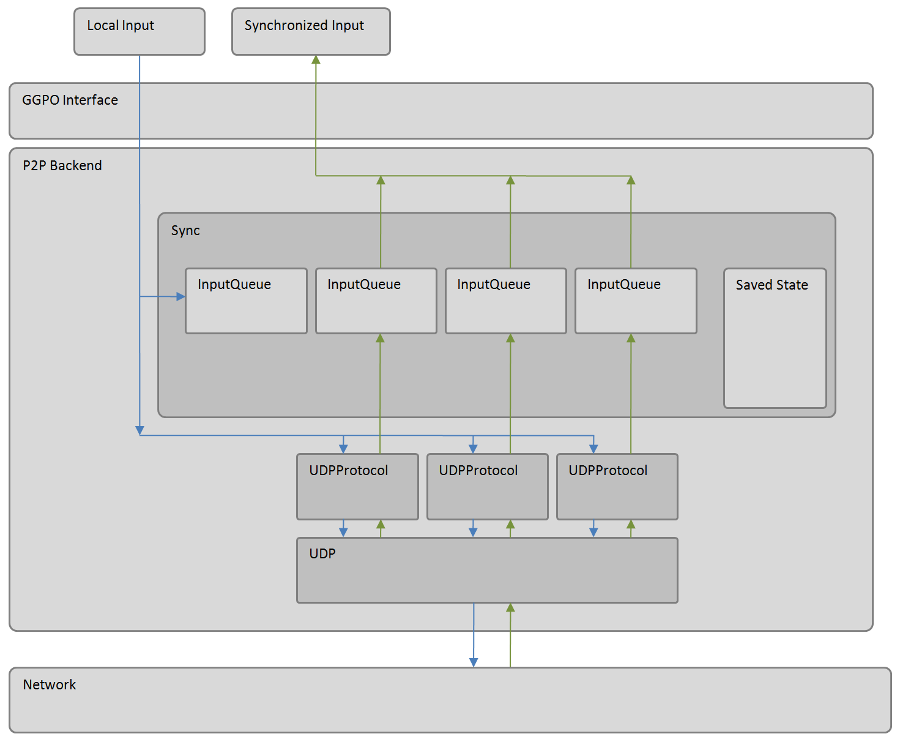

# What Is GGPO?

Created in 2009, the GGPO networking SDK pioneered the use of rollback networking in peer-to-peer games.  It's designed specifically to hide network latency in fast paced, twitch style games which require very precise inputs and frame perfect execution.

Traditional techniques account for network transmission time by adding delay to a players input, resulting in a sluggish, laggy game-feel.  Rollback networking uses input prediction and speculative execution to send player inputs to the game immediately, providing the illusion of a zero-latency network.  Using rollback, the same timings, reactions visual and audio queues, and muscle memory your players build up playing offline translate directly online.  The GGPO networking SDK is designed to make incorporating rollback networking into new and existing games as easy as possible.  

# How Does It Work?

Rollback networking is designed to be integrated into a fully deterministic peer-to-peer engine.  With full determinism, the game is guaranteed to play out the same way on all players computers if we simply feed them the same inputs.  One way to achieve this is to exchange inputs for all players over the network, only executing a frame of gameplay logic when all players have received all the inputs from their peers.  This often results in sluggish, unresponsive gameplay.  The longer it takes to get inputs over the network, the slower the game becomes.

## Networking Using Input Delay

### In Theory...

Take a look at the diagram below.  It shows how 2 clients are kept synchronized in an ideal network with 0 milliseconds of latency.  Player 1’s inputs and game state are shown in blue, player 2’s inputs are show in red, and the network layer is shown in green.   The black arrows indicate how inputs move through the system and transitions from one game state to the next.  Each frame is separated by a horizontal, dashed line.  Although the diagram only shows what happens from the perspective of player 1, the game on player 2’s end goes through the exact same steps.  

The inputs for player 1 are merged with the inputs from player 2 by the network layer before sending them to the game engine.  The engine modifies the game state for the current frame using those inputs.  Player 2 does the same thing: merging player 1’s inputs with his own before sending the combined inputs to the game engine.  The game proceeds in this manner every frame, modifying the previous frame's game state by applying logic according to the value of the the player inputs.  Since player 1 and player 2 both began with the same game state and the inputs they send to their respective engines are the same, the game states of the two players will remain synchronized on every frame.

### In Practice..

The Ideal Network example assumes that packets are transmitted over the network instantaneously.  Reality isn’t quite so rosy.  Typical broadband connections take anywhere between 5 and 150 milliseconds to transmit a packet, depending on the distance between the players and the quality of the infrastructure where the players live.  That could be anywhere between 1 and 9 frames If your game runs at 60 frames per seconds.

Since the game cannot process the frame until it has received the inputs from both players, it must apply 1 to 9 frame delay, or “lag”, on each player’s inputs.  Let’s modify the previous diagram to take latency into account:

In this example it takes 3 frames to transmit a packet.  This means the remote inputs sent by player 2 at frame 1 don’t arrive at player 1’s game console until 3 frames later.  The game engine for player 1 cannot advance until it receives the input, so it’s forced to delay the frame 1 for 3 frames.  All subsequent frames are delayed by 3 frames as well.  The network layer is generally forced to delay all merged inputs by the maximum one way transit time of the packets sent between the two players.  This lag is enough to substantially affect the quality of the game play experience for many game types in all but the most ideal networking conditions.

## Removing Input Delay with Rollback Networking

### Speculative Execution

GGPO prevents the input lag by hiding the latency required to send a packet using speculative execution.  Let’s see another diagram:

Instead of waiting for the input to arrive from the remote player, the GGPO predicts what the other player is likely to do based on past inputs.  It combines the predicted input with player 1’s local input and immediately passes the merged inputs to your game engine so it can proceed executing the next frame, even though you have not yet received the packet containing the inputs from the other player.  
If GGPO’s prediction were perfect, the user experience playing online would be identical to playing offline.  Of course, no one can predict the future!  GGPO will occasionally incorrectly predict player 2’s inputs.  Take another look at the diagram above.  What happens if GGPO send the wrong inputs for player 2 at frame 1?  The inputs for player 2 would be different on player 1’s game than in player 2’s.  The two games will lose synchronization and the players will be left interacting with different versions of reality.  The synchronization loss cannot possibly be discovered until frame 4 when player 1 receives the correct inputs for player 2, but by then it’s too late.  
This is why GGPO’s method is called “speculative execution”.  What the current player sees at the current frame may be correct, but it may not be.  When GGPO incorrectly predicts the inputs for the remote player, it needs correct that error before proceeding on to the next frame.  The next example explains how that happens.

### Correcting Speculative Execution Errors with Rollbacks

GGPO uses rollbacks to resynchronize the clients whenever it incorrectly predicts what the remote player will do.  The term "rollback" refers to the process of rewinding state and predicting new outcomes based on new, more correct information about a player's input.  In the previous section we wondered what would happen if the predicted frame for remote input 1 was incorrect.  Let’s see how GGPO corrects the error:

GGPO checks the quality of its prediction for previous frames every time receives a remote input.  As mentioned earlier, GGPO doesn’t receive the inputs for player 2’s first frame until player 1’s fourth.  At frame 4, GGPO notices that the inputs received from the network do not match the predicted inputs sent at earlier.  To resynchronize the two games, GGPO needs undo the damage caused by running the game with incorrect inputs for 3 frames.  It does this by asking the game engine to go back in time to a frame before the erroneously speculated inputs were sent (i.e. to "rollback" to a previous state).   Once the previous state has been restored, GGPO asks the engine to move forward one frame at a time with the corrected input stream.  These frames are shown in light blue.  Your game engine should advance through these frames as quickly as possible with no visible effect to the user.  For example, your video renderer should not draw these frames to the screen.  Your audio renderer should ideally continue to generate audio, but it should not be rendered it until after the rollback, at which point samples should start playing n frames in, where n is the current frame minus the frame where the sample was generated.
Once your engine reaches the frame it was on before GGPO discovered the error, GGPO drops out of rollback mode and allows the game to proceed as normal.  Frames 5 and 6 in the diagram show what happens when GGPO predicts correctly.  Since the game state is correct, there’s no reason to rollback.

# Code Structure

The following diagram shows the major moving parts in the GGPO session object and their relationship to each other.  Each component is describe in detail below.

## GGPO Interface

The GGPO interface abstracts away the implementation details between the P2P and the Sync Test backends.  The proper backend is created automatically when you call the ggpo_start_session or ggpo_start_synctest entry points.

## P2P Backend

The P2P backend orchestrates a game between players.  It is created by the ggpo_start_session API call.  Most of the heavy lifting is done by the contained helper classes.

## Poll Object

(not pictured).  The poll object is a registration mechanism used by the other objects in the code.  It delivers timers and notifications when waitable objects become ready.  For example, the UDP backend uses the Poll object to receive notifications when new packets arrive. 

## Sync Object

The sync object is used to keep track of the last n-frames of game state.  When its embedded prediction object notifies it of a prediction error, the Sync backend rewinds the game to the more-correct state and single-steps forward to correct the prediction error.

## Input Queue Object

The InputQueue object keeps track of all the inputs received for a local or remote player.  When asked for an input which it doesn't have, the input queue predicts the next input, and keeps track of this information for later so they sync object will know where to rollback to if the prediction was incorrect.  The input queue also implements the frame-delay if requested.

## UDP Protocol Object

The UDP protocol object handles the synchronization and input exchange protocols between any two players.  It also implements the game input compression and reliable-UDP layer.  Each UDP Protocol object has a contained TimeSync object which is uses to approximate the wall clock time skew between two players.

## UDP Object

The UDP object is simply a dumb UDP packet sender/receiver.  It’s divorced from UDP protocol to ease ports to other platforms.

## Sync Test Backend

(not pictured) The Sync Test backend uses the same Sync object as the P2P backend to verify your application’s save state and stepping functionally execute deterministically.  For more information on sync test uses, consult the Programmers Guide.
